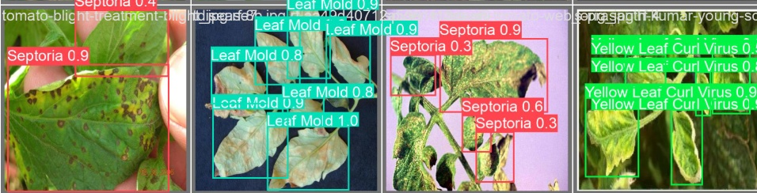

# 🌿 Otonom Yaprak Hastalığı Teşhis ve Karar Destek Sistemi (Autonomous Leaf Disease Diagnosis & Risk System)

Bu proje, otonom tarım robotları için geliştirilmiş **Çok Katmanlı (Pipeline)** bir bilgisayarlı görü ve makine öğrenmesi sistemidir. Amacımız; tarlalarda devriye gezen otonom bir sistemin bitki yapraklarındaki hastalıkları tespit etmesi (Katman 1) ve tespit edilen hastalığın türü ile yayılma oranını analiz ederek otonom müdahale/ilaçlama kararları almasını (Katman 2) sağlamaktır. Sistem **Hassas Tarım** prensibiyle çalışarak kimyasal kullanımını minimize eder.



## 🚀 Teknolojik Altyapı ve Sistem Mimarisi
Proje iki ana modülden (Pipeline) oluşmaktadır:
* **Katman 1 (Görüntü İşleme):** YOLOv11s (Hız ve yüksek doğruluk optimizasyonu), OpenCV
* **Katman 2 (Karar & Risk Analizi):** Scikit-learn (Linear Regression), Pandas, Numpy
* **Donanım Hedefi:** Otonom Zirai İnsansız Kara Araçları (İKA)

---

## 👁️ Katman 1: YOLOv11 Hastalık Tespiti ve Metrikler
Model, karmaşık tarım ortamlarındaki yaprak verileriyle eğitilmiş olup son derece yüksek doğruluk oranlarına ulaşmıştır.

* **Genel mAP50 Skoru:** **%87.5**
* **Ölümcül Hastalık Tespit Oranları:**
  * Mosaic Virus: **%94.0**
  * Late Blight: **%93.9**
  * Spider Mites: **%91.0**
  * Bacterial Spot: **%90.4**

> Detaylı eğitim süreci, Loss eğrileri ve Confusion Matrix (Hata Matrisi) raporlarına `results/` klasörü altından ulaşabilirsiniz.

### 🛠️ Mühendislik Yaklaşımı (Katman 1)
1. **"Label Noise" ve False-Positive Optimizasyonu:** Eğitim verisindeki eksik etiketlenmiş arka plan sağlıklı yaprakların modeli zehirlediği tespit edilmiştir. Otonom robotun asıl amacı hastalığı bulmak olduğundan, "Healthy" (Sağlıklı) sınıfı model eğitiminden tamamen çıkarılmış ve sistemin mAP skorunda **+%13'lük muazzam bir artış** sağlanmıştır.
2. **Dinamik Güven Eşiği:** *Yellow Leaf Curl Virus (YLCV)* gibi morfolojik bozukluk içeren hastalıklar için özel bir "Dinamik Tolerans" yazılmış; zor hastalıklar için eşik değeri `conf=0.25` seviyesine çekilerek robotun bu hastalıkları kaçırma (False Negative) riski sıfırlanmıştır.

---

## 🧠 Katman 2: Makine Öğrenmesi ile Risk Analizi (Decision Engine)
YOLOv11'in sadece tespit yapması "otonom müdahale" için yeterli değildir. Bu aşamada sisteme bir **Lineer Regresyon (Linear Regression)** modeli entegre edilmiştir. 
* **MAE (Ortalama Mutlak Hata):** **4.65**
* **R^2 Skoru :** **0.942 (%94.2)**


  * **Çalışma Mantığı:** YOLOv11'den gelen "Hastalık Tehlike Katsayısı" ve bounding box tabanlı "Yayılma Oranı (%)", ML modeline girdi olarak verilir. Model, bitkinin ne kadar acil bir müdahaleye (ilaç/valf tepkisi) ihtiyacı olduğunu 0-100 arası bir **Toplam Risk Skoru** ile hesaplar.
  * **Eğitim ve Simülasyon:** Model, 450 farklı senaryo barındıran bir veri setiyle eğitilmiştir. Sistemin sahada (gerçek tarlada) karşılaşabileceği sensör ve okuma sapmalarını simüle etmek amacıyla eğitim verisine **Matematiksel Gaussian Gürültü (Noise)** eklenmiş, modelin ezber yapması (overfitting) engellenmiştir. (Model dosyası: `models/linear_risk_model_v4_noisy.pkl`)

---

## 💻 Kurulum ve Çalıştırma

Projeyi kendi bilgisayarınızda (Inference Modunda) çalıştırmak için aşağıdaki adımları izleyin:

### 1. Repoyu Klonlayın
```bash
git clone [https://github.com/UmutUsenmez/Disease-Diagnosis-Module.git](https://github.com/UmutUsenmez/Disease-Diagnosis-Module.git)
cd Disease-Diagnosis-Module
```

### 2. Gerekli Kütüphaneleri Kurun
```bash
pip install -r requirements.txt
```

### 3. Test Görüntüsü ile Modeli Çalıştırın
```bash
python src/detect_disease.py assets/test_yaprak.jpg
```

